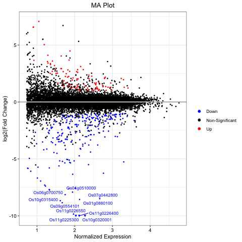

# GoTools Manual

### 1. Install and Load GoTools

```R
devtools::install_github('rfitak/GOtools', upgrade = F)
library(GOtools)
```


### 2. Read in datasets

####      2.1 Read in count matrix

```R
# Get path to practice data file included in this R package
count.file <- system.file("extdata/count.txt", package = "GOtools")

# Load this data file
count = read.delim(count.file, header = T, sep = "\t", row.names = 1)
```

The count matrix should be:

1. plain text
2. tab delimited
3. Genes as rows
4. samples as columns
5. The first column should contain unique gene IDs, without a header.

See the example below.  Other formats can be loaded (e.g., csv) but no example code is provided.

|              | S1   | S2   | S3   | S4   | S5   | S6   | S7   | S8   | S9   |
| ------------ | ---- | ---- | ---- | ---- | ---- | ---- | ---- | ---- | ---- |
| Os01g0100200 | 1    | 0    | 0    | 0    | 1    | 0    | 2    | 1    | 0    |
| Os01g0100400 | 344  | 330  | 415  | 345  | 306  | 477  | 435  | 488  | 284  |
| Os01g0100466 | 0    | 0    | 0    | 0    | 0    | 0    | 0    | 0    | 0    |
| Os01g0100500 | 1281 | 1213 | 1406 | 912  | 1025 | 1329 | 1111 | 1336 | 769  |
| Os01g0100600 | 101  | 108  | 118  | 84   | 80   | 106  | 93   | 129  | 78   |
| Os01g0100900 | 1157 | 1025 | 1066 | 787  | 1051 | 1051 | 951  | 1182 | 613  |

####          2.2 Read in group (i.e. sample) metadata

```R
# Get path to practice data file included in this R package
group.file <- system.file("extdata/group.txt", package = "GOtools")

# Load this data file
group <- read.delim(group.file, header = T, sep = "\t")
```

See example grouping table below:

| Sample | Group |
| ------ | ----- |
| S1     | A     |
| S2     | A     |
| S3     | A     |
| S4     | B     |
| S5     | B     |
| S6     | B     |
| S7     | C     |
| S8     | C     |
| S9     | C     |

### 3. Differential Gene Expression Analysis

####      3.1 DEG Analysis using DESeq2

```R
# See manual ?DEGAnalysis_DESeq2 for full details and implementation
resultFilePath <- DEGAnalysis_DESeq2(count, group, outdir = "output",
                                     useFDR = F, cut = 0.05, FCcut = 2, control = "A", treat = "B")
```

The output files are written to a folder `output` with the follwing contents:

| File               |                                                              |
| ------------------ | ------------------------------------------------------------ |
| A.vs.B.AllGene.tsv | Information file of log2FC, Pvalue, etc. of all genes        |
| A.vs.B.DEG.tsv     | Information file of log2FC, Pvalue, etc. of ONLY differntially expressed genes |
| A.vs.B.DEGlist.tsv | Differential gene list, only differential gene names         |

* replace "A" and "B" with the control and treatment group names.

* The calculation method of 𝑙𝑜𝑔<sub>2</sub>(𝐹𝑜𝑙𝑑𝐶ℎ𝑎𝑛𝑔𝑒) is:
  $$
  𝑙𝑜𝑔_2 (𝐹𝑜𝑙𝑑 𝐶ℎ𝑎𝑛𝑔𝑒) = {𝑙𝑜𝑔_2 ({𝐸𝑥𝑝𝑟𝑒𝑠𝑠𝑖𝑜𝑛(𝐶𝑎𝑠𝑒) \over 𝐸𝑥𝑝𝑟𝑒𝑠𝑠𝑖𝑜𝑛(𝐶𝑜𝑛𝑡𝑟𝑜𝑙)})}
  $$

* The differential expression results are also stored in the R object `$resultFilePath` as `resultFilePath$allgene` and `resultFilePath$deg`


```R
allgenes = read.delim(resultFilePath$allgene, header = T, row.names = 1)
degs = read.delim(resultFilePath$deg, header = T, row.names = 1)
```

The output table will look similar to this:

|              | S1          | S2         | S3         | S4         | S5          | S6          | MeanExpression | log2FoldChange | Pvalue    | FDR       |
| ------------ | ----------- | ---------- | ---------- | ---------- | ----------- | ----------- | -------------- | -------------- | --------- | --------- |
| Os01g0111700 | 78.796912   | 12.244902  | 19.766978  | 6.259099   | 16.000699   | 5.3400162   | 23.06810       | -2.018871      | 0.0142885 | 0.1371295 |
| Os01g0112400 | 259.296814  | 13.186818  | 79.067911  | 594.614457 | 3360.146851 | 180.6705496 | 747.83057      | 3.556148       | 0.0117534 | 0.1230981 |
| Os01g0112600 | 92.540559   | 60.282594  | 21.485845  | 11.266379  | 1.230823    | 0.8900027   | 31.28270       | -3.755901      | 0.0000148 | 0.0010328 |
| Os01g0117500 | 5.497459    | 1.883831   | 7.734904   | 17.525479  | 24.616460   | 15.1300460  | 12.06470       | 1.906998       | 0.0107076 | 0.1168868 |
| Os01g0121600 | 1401.852035 | 815.698851 | 184.778270 | 386.812352 | 158.776170  | 131.7204007 | 513.27301      | -1.827102      | 0.0363427 | 0.2373220 |
| Os01g0123900 | 50.393374   | 128.100512 | 31.799051  | 27.540038  | 13.539053   | 31.1500948  | 47.08702       | -1.532813      | 0.0091684 | 0.1070213 |

####      3.2 DEG Analysis using EBSeq

For cases without biological replication, EBSeq can be used for differential analysis.

Specify the sample name of the control and the sample name of the treatment. If these two parameters are not entered, the interactive mode will be entered.

```R
# See manual ?DEGAnalysis_EBseq for full details and implementation
resultFilePath = DEGAnalysis_EBSeq(count, outdir = "output",
                                   cut = 0.05, FCcut = 2, control = "S1", treat = "S2")
```

The output files are written to a folder `output` with the follwing contents:

| File                 |                                                              |
| -------------------- | ------------------------------------------------------------ |
| S1.vs.S2.AllGene.tsv | Information file of log2FC, Pvalue, etc. of all genes        |
| S1.vs.S2.DEG.tsv     | Information file of log2FC, Pvalue, etc. of ONLY differntially expressed genes |
| S1.vs.S2.DEGlist.tsv | Differential gene list, only differential gene names         |

The differential expression results are also stored in the R object `$resultFilePath` as `resultFilePath$allgene` and `resultFilePath$deg`

```R
allgenes = read.delim(resultFilePath$allgene, header = T, row.names = 1)
degs = read.delim(resultFilePath$deg, header = T, row.names = 1)
```

The output table will look similar to this:

|              | S1         | S2          | MeanExpression | log2FoldChange | FDR       |
| ------------ | ---------- | ----------- | -------------- | -------------- | --------- |
| Os01g0111700 | 84.69305   | 13.200611   | 48.94683       | -2.632023      | 0.0000000 |
| Os01g0112400 | 278.69922  | 14.216043   | 146.45763      | -4.241132      | 0.0000000 |
| Os01g0123900 | 54.16416   | 138.098700  | 96.13143       | 1.341436       | 0.0001719 |
| Os01g0127600 | 1952.86414 | 7937.628966 | 4945.24656     | 2.022810       | 0.0000000 |
| Os01g0614300 | 315.13693  | 136.067837  | 225.60238      | -1.208344      | 0.0000004 |
| Os01g0677400 | 24.62007   | 2.030863    | 13.32547       | -3.285424      | 0.0056083 |

### 4. Plotting Differential Gene Expression

Plotting parameters for both `VolcanoPlot` and `MAPlot`:

| Option        | Explanation                                                  | Possible Values                                              |
| ------------- | ------------------------------------------------------------ | ------------------------------------------------------------ |
| showlabel     | Whether to display the names of significant genes            | *allSig*: label all significant genes<br />*topPvalue*: label gene with the smallest Pvalue<br />*topFC*: label the gene with the largest FC<br />*no*: do not label |
| showlabel.num | Specifies the number of genes to display. This is valid when showlabel is topPvalue or topFC. | [Integers]                                                   |
| xlim          | x-axis display range                                         | [Integers]                                                   |
| useFDR        | Whether to use FDR as significance. The specific significance threshold is defined by `cut` and `FCcut`. | TRUE or FALSE (Boolean)                                      |
| cut           | Significance threshold. When `useFDR=T`, it represents the FDR threshold. When `useFDR=F`, it represents the Pvalue threshold. | Decimal number between 0 and 1 [Float]                       |
| FCcut         | Fold Change Threshold                                        | Any number greater than 1                                    |
| MainTitle     | The title of the plot                                        | String                                                       |

 

####      4.1 Volcano Plot

```R
VolcanoPlot(allgenes, useFDR = T, cut = 0.05, FCcut = 2, MainTitle = "Volcano Plot",
            showlabel = "topPvalue", showlabel.num = 10, xlim = 10)
```


####      4.2 MA Plot

```R
MAPlot(allgenes, useFDR = T, cut = 0.05, FCcut = 2, MainTitle = "MA Plot",
       showlabel = "topFC", showlabel.num = 10, ylim = 10)
```



### 5. GO Enrichment Analysis

####      5.1 GO Enrichment analysis of common species

Use this when GO terms assigned to gene IDs are readily available in databases. This software package already contains GO annotation information for common species, which can be viewed using the following command:

```R
# View species information in the GO database
GOdbInfo()
```

Example output (**NOTE** - this needs to be updated with more relevant databases soon!!!!):

```
  taxon      ReferenceGenomeVersion   update           IDformat
    osa                   IRGSP-1.0 20210518       Os05g0375100
    ath                      TAIR10 20210518          AT1G01090
    mdm                 ASM211411v1 20210518       MD17G0149700
    pop                  Pop_tri_v3 20210518 POPTR_001G122400v3
    sbi      Sorghum_bicolor_NCBIv3 20210518  SORBI_3008G059900
    sly                       SL3.0 20210518   Solyc09g064370.3
 zma.V4               B73 RefGen_v4 20210518     Zm00001d042869
 zma.V5    Zm-B73-REFERENCE-NAM-5.0 20210518    Zm00001eb148000
    pca Pogostemon_Cablin_sdata2018 20210613    GLYMA_19G000700
    gmx            Glycine_max_v2.1 20210613         Pcab093315
```

Perform enrichment analysis:

```R
# Load this data file
deg.file <- system.file("demo/demo.rice.deg.txt", package = "GOtools")
deg = read.delim(deg.file, header = F)$V1

# Perform GO enrichment
GOresult = GOEnrich(deglist = deg, taxon = "osa", useFDR = F, cut = 0.05, outdir = "output", outprefix = "demo.osa")
```

Parameter description for `GOEnrich`:

| Option    | Explanation                                                  | Possible Values                                         |
| :-------- | :----------------------------------------------------------- | :------------------------------------------------------ |
| deglist   | Differential gene list object                                | Required                                                |
| taxon     | Species Abbreviation                                         | [String]<br />The taxon column in the GOdbInfo() result |
| useFDR    | Whether to use FDR as significance. The specific significance threshold is defined by `cut` and `FCcut`. | TRUE or FALSE (Boolean)                                 |
| nodeSize  | prune the GO hierarchy from the terms which have less than   | [integer] ≥1                                            |
| cut       | nodeSize annotated genesSignificance threshold. When `useFDR=T`, it represents the FDR threshold. When `useFDR=F`, it represents the Pvalue threshold. | Decimal number between 0 and 1 [Float]                  |
| outdir    | Output result directory                                      | Required                                                |
| outprefix | Output result file prefix                                    | Required                                                |

####      5.2 GO Enrichment analysis of custom annotations (no reference species, or self-annotated species)

This is used with the output of [PANNZER2](http://ekhidna2.biocenter.helsinki.fi/sanspanz/). PANNZER2 database annotates the submitted protein sequence files with GO terms, and is both fast and comprehensive.  This enrichment analysis specifically interfaces with the GO prediction file produced by PANNZER2 (`GO.txt`).

Perform enrichment analysis:

```R
# Load these data files
deg.file <- system.file("demo/demo.rice.deg.txt", package = "GOtools")
deg = read.delim(deg.file, header = F)$V1
panz <- system.file("demo/demo.pannzer.GO.txt", package = "GOtools")

# Perform GO enrichment
GOresult = GOEnrich_pannzer2(deglist = deg, useFDR = F, cut = 0.05,
                             pannzerfile = panz, outdir = "output", outprefix = "Pannzer2.go")
```

Parameter description for `GOEnrich_pannzer2`:

| Option      | Explanation                                                  | Possible Values                        |
| :---------- | :----------------------------------------------------------- | :------------------------------------- |
| deglist     | Differential gene list object                                | Required                               |
| pannzerfile | GO.txt annotation file using pannzer2 database               | string                                 |
| useFDR      | Whether to use FDR as significance. The specific significance threshold is defined by `cut` and `FCcut`. | TRUE or FALSE (Boolean)                |
| nodeSize    | prune the GO hierarchy from the terms which have less than   | [integer] ≥1                           |
| cut         | nodeSize annotated genesSignificance threshold. When `useFDR=T`, it represents the FDR threshold. When `useFDR=F`, it represents the Pvalue threshold. | Decimal number between 0 and 1 [Float] |
| outdir      | Output result directory                                      | Required                               |
| outprefix   | Output result file prefix                                    | Required                               |

### 6. Plot GO Enrichment Analysis

####      6.1 GO Bubble Plot

```R
GObubble(dataset = GOresult, onlySig = T, useFDR = F, cut = 0.05, top = 10,
         TrimTerm = F, TermWidth = 50, MainTitle = "GO plot", ColorScheme = "rw", ColorReverse = F)
```


| Option       | Explanation                                                  | Possible Values                                              |
| ------------ | ------------------------------------------------------------ | ------------------------------------------------------------ |
| dataset      | Annotation result variables obtained by GOEnrich             | Required                                                     |
| onlySig      | Whether to display only significant function nodes           | TRUE or FALSE (Boolean)                                      |
| useFDR       | Whether to use FDR as significance. The specific significance threshold is defined by `cut` and `FCcut`. | TRUE or FALSE (Boolean)                                      |
| cut          | Significance threshold. When `useFDR=T`, it represents the FDR threshold. When `useFDR=F`, it represents the Pvalue threshold. | Decimal number between 0 and 1 [Float]                       |
| top          | Output the first n function nodes of BP, MF, and CC respectively<br/>The final output function satisfies both `top` and `cut` parameters | >1                                                           |
| MainTitle    | The title of the plot                                        | String                                                       |
| ColorScheme  | Color scheme                                                 | ryb, rwb, ryg, rwg, rw, bw, gw<br/>where r is red, y is yellow, w is white, b is blue, and g is green |
| ColorReverse | Whether to reverse the order of the colors in the ColorScheme | TRUE or FALSE (Boolean)                                      |
| TrimTerm     | Whether to cut and shorten the long term name                | TRUE or FALSE (Boolean)                                      |
| TermWidth    | If `TrimTerm` is T, the first `TermWidth` characters are cut directly, otherwise the line is automatically wrapped according to the length of `TermWidth`. | Default is 60                                                |

####      6.2 GO secondary node annotation bar chart

Draw a bar chart of all genes and differentially expressed genes for all secondary nodes in the GO database:

```R
GOBar(deg, pannzer2 = panz)
```


